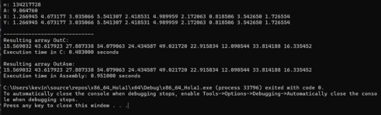
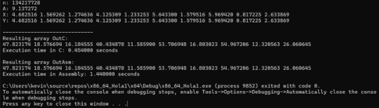

# **Members:**

TUCO, KEVIN BRYAN L. 

SATOS, KACI RENEA G.

# **SPECS**

# **Example Output**

# **Comparative Analysis**

We tested the performance of the 2 kernels by creating a C program that calls both versions and inputs the same, randomized inputs for both. The sanity check will be from C, though we have triple checked by manually calculating the results on the first few tests to make sure.

After doing tests for 220, 224, and 227, the difference between the run time average of C and Assembly are 0.003966, 0.0543, and 0.506167 respectively for Debug Mode. 

For Release Mode, the differences are 0.004504, 0.096829, 0.9325873.

Taking note that the runtime lower of C is shorter as compared to Assembly, which has a higher runtime average. Thus, it can be concluded that the C version of the function is faster as compared to the Assembly function from the given specs; this is even more apparent in Release Mode, C became a bit faster and Assembly became a bit slower.

# **Average Runtime**

## **Summary:** 

**Debug**

|**N**|**Ave C**|**Ave ASM**|
| - | - | - |
|**2^20 = 1048576**|**0.003567**|**0.007533**|
|**2^24 = 16777216**|**0.060933**|**0.115233**|
|**2^27 = 134217728**|**0.3808**|**0.886967**|

**Release**

|**N**|**Ave C**|**Ave ASM**|
| - | - | - |
|**2^20 = 1048576**|**0.002852**|**0.007356**|
|**2^24 = 16777216**|**0.036796**|**0.133625**|
|**2^27 = 134217728**|**0.2289097**|**1.161497**|

## **Debug Rundown:**

|**2^20 = 1048576**|||
| - | :- | :- |
|RUN|C|ASM|
|1|0\.004|0\.01|
|2|0\.003|0\.006|
|3|0\.004|0\.007|
|4|0\.004|0\.007|
|5|0\.003|0\.008|
|6|0\.003|0\.009|
|7|0\.004|0\.008|
|8|0\.003|0\.008|
|9|0\.004|0\.007|
|10|0\.005|0\.007|
|11|0\.003|0\.008|
|12|0\.003|0\.008|
|13|0\.003|0\.007|
|14|0\.004|0\.006|
|15|0\.003|0\.008|
|16|0\.004|0\.008|
|17|0\.004|0\.007|
|18|0\.004|0\.007|
|19|0\.004|0\.007|
|20|0\.004|0\.009|
|21|0\.004|0\.007|
|22|0\.003|0\.008|
|23|0\.003|0\.007|
|24|0\.003|0\.007|

|25|0\.004|0\.007|
| - | - | - |
|26|0\.004|0\.008|
|27|0\.004|0\.007|
|28|0\.003|0\.008|
|29|0\.003|0\.008|
|30|0\.003|0\.007|
|**AVE**|**0.003567**|**0.007533**|

|**2^24 = 16777216**|||
| - | :- | :- |
|RUN|C|ASM|
|1|0\.046|0\.156|
|2|0\.046|0\.165|
|3|0\.047|0\.145|
|4|0\.045|0\.102|
|5|0\.045|0\.104|
|6|0\.047|0\.111|
|7|0\.047|0\.104|
|8|0\.048|0\.104|
|9|0\.055|0\.118|
|10|0\.044|0\.11|
|11|0\.048|0\.124|
|12|0\.045|0\.113|
|13|0\.046|0\.113|
|14|0\.047|0\.112|

|15|0\.045|0\.12|
| - | - | - |
|16|0\.046|0\.106|
|17|0\.45|0\.119|
|18|0\.048|0\.107|
|19|0\.046|0\.122|
|20|0\.051|0\.105|
|21|0\.045|0\.108|
|22|0\.047|0\.117|
|23|0\.047|0\.122|
|24|0\.046|0\.101|
|25|0\.051|0\.107|
|26|0\.047|0\.108|
|27|0\.048|0\.112|
|28|0\.057|0\.106|
|29|0\.054|0\.107|
|30|0\.044|0\.109|
|**AVE**|**0.060933**|**0.115233**|

|**2^27 = 134217728**|||
| - | :- | :- |
|RUN|C|ASM|
|1|0\.476|1\.219|
|2|0\.563|1\.412|
|3|0\.371|0\.838|

|4|0\.411|0\.852|
| - | - | - |
|5|0\.413|0\.81|
|6|0\.392|0\.83|
|7|0\.442|0\.878|
|8|0\.435|0\.86|
|9|0\.381|0\.813|
|10|0\.392|0\.945|
|11|0\.389|0\.911|
|12|0\.367|0\.86|
|13|0\.358|0\.826|
|14|0\.34|0\.797|
|15|0\.352|0\.83|
|16|0\.343|0\.83|
|17|0\.356|0\.876|
|18|0\.355|0\.813|
|19|0\.352|0\.819|
|20|0\.364|0\.846|
|21|0\.347|0\.839|
|22|0\.351|0\.825|
|23|0\.385|0\.954|
|24|0\.365|0\.85|
|25|0\.356|0\.913|
|26|0\.358|0\.886|
|27|0\.359|0\.913|

|28|0\.34|0\.822|
| - | - | - |
|29|0\.358|0\.88|
|30|0\.353|0\.862|
|**AVE**|**0.3808**|**0.886967**|

# **Release Rundown:**

|**2^20 = 1048576**|||
| - | :- | :- |
|RUN|C|ASM|
|1|0\.002317|0\.010119|
|2|0\.001851|0\.006923|
|3|0\.00307|0\.007767|
|4|0\.001855|0\.00622|
|5|0\.002514|0\.008503|
|6|0\.001815|0\.007114|
|7|0\.001885|0\.007991|
|8|0\.002712|0\.006847|
|9|0\.001739|0\.008516|
|10|0\.00203|0\.006238|
|11|0\.002061|0\.008233|
|12|0\.002817|0\.006241|
|13|0\.00228|0\.006463|
|14|0\.001895|0\.007029|
|15|0\.001849|0\.007389|
|16|0\.00268|0\.007741|
|17|0\.001842|0\.007246|
|18|0\.001869|0\.007162|
|19|0\.00402|0\.007581|
|20|0\.003231|0\.007604|
|21|0\.00236|0\.007217|
|22|0\.002263|0\.007031|
|23|0\.001951|0\.007693|
|24|0\.002074|0\.006785|

|**2^24 = 16777216**|||
| - | :- | :- |
|RUN|C|ASM|
|1|0\.037161|0\.179044|
|2|0\.033089|0\.128035|
|3|0\.035999|0\.13302|
|4|0\.034424|0\.122189|
|5|0\.031518|0\.139723|
|6|0\.033445|0\.138803|
|7|0\.032919|0\.140711|
|8|0\.031488|0\.134072|
|9|0\.035921|0\.135547|
|10|0\.033317|0\.126234|
|11|0\.038231|0\.126021|
|12|0\.035887|0\.132039|
|13|0\.034079|0\.14096|
|14|0\.03639|0\.128733|

|15|0\.034646|0\.13121|
| - | - | - |
|16|0\.038275|0\.13913|
|17|0\.033099|0\.134151|
|18|0\.033102|0\.133024|
|19|0\.042849|0\.116806|
|20|0\.045047|0\.12402|
|21|0\.036013|0\.133478|
|22|0\.035671|0\.148146|
|23|0\.041656|0\.122826|
|24|0\.042695|0\.130463|
|25|0\.043304|0\.126161|
|26|0\.038947|0\.13759|
|27|0\.036764|0\.131869|
|28|0\.043389|0\.126013|
|29|0\.039835|0\.129382|
|30|0\.034724|0\.139338|
|**AVE**|**0.036796**|**0.133625**|

|**2^27 = 134217728**|||
| - | :- | :- |
|RUN|C|ASM|
|1|0\.264221|1\.669584|
|2|0\.262424|1\.055538|
|3|0\.21866|1\.074863|

|4|0\.213426|1\.014226|
| - | - | - |
|5|0\.228914|1\.084394|
|6|0\.22912|1\.088558|
|7|0\.220787|1\.094654|
|8|0\.229485|1\.165194|
|9|0\.217409|1\.134332|
|10|0\.212031|1\.123243|
|11|0\.21773|1\.23884|
|12|0\.24889|1\.185344|
|13|0\.221653|1\.137307|
|14|0\.218946|1\.16719|
|15|0\.21165|1\.192118|
|16|0\.210446|1\.195911|
|17|0\.234498|1\.182768|
|18|0\.218016|1\.093617|
|19|0\.225927|1\.137258|
|20|0\.233474|1\.141765|
|21|0\.223869|1\.179693|
|22|0\.249425|1\.236401|
|23|0\.223338|1\.158852|
|24|0\.262268|1\.140417|
|25|0\.253012|1\.179428|
|26|0\.214079|1\.125465|
|27|0\.21878|1\.143394|

|28|0\.231014|1\.152645|
| - | - | - |
|29|0\.23985|1\.263631|
|30|0\.213949|1\.088273|
|**AVE**|**0.2289097**|**1.161497**|

